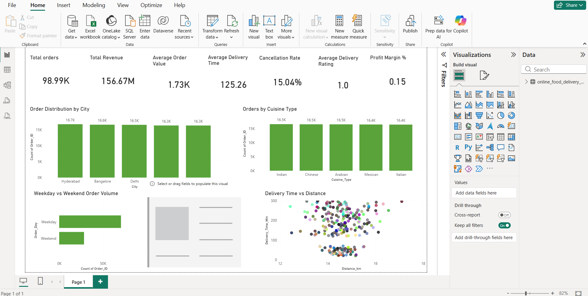

# Online Food Delivery Analysis

## Project Overview

This project analyzes an online food delivery dataset to uncover business insights related to customer behavior, revenue trends, delivery performance, and restaurant performance.

The analysis was performed using **Python, SQL, and Power BI**.

## Dataset

The dataset contains approximately **98,000 orders** with information about:

* Customer details
* Order details
* Delivery information
* Restaurant data
* Revenue and profit metrics

## Tools & Technologies

* Python (Pandas, NumPy, Matplotlib)
* MySQL
* Power BI
* VS Code
* GitHub

## Data Analysis Steps

1. Data Collection and Dataset Verification
2. Data Understanding and Cleaning
3. Exploratory Data Analysis (EDA)
4. Feature Engineering
5. MySQL Database Storage
6. Business Analytics Queries
7. Power BI Dashboard Creation

## Key Insights

* Weekday orders are significantly higher than weekend orders.
* Bangalore generates the highest revenue among all cities.
* Delivery time is moderately related to distance.
* Discounts do not significantly reduce profit margins.
* Late delivery is the most common reason for order cancellation.

## Dashboard KPIs

* Total Orders
* Total Revenue
* Average Order Value
* Average Delivery Time
* Cancellation Rate
* Profit Margin %

## Dashboard

The Power BI dashboard visualizes key metrics including order distribution, revenue trends, delivery performance, and customer behavior.

## Project Structure

online-food-delivery-analysis/
│
├── data/
├── notebooks/
├── sql/
├── dashboard/
└── README.md

## Author

Keerthu
## Dashboard Preview
